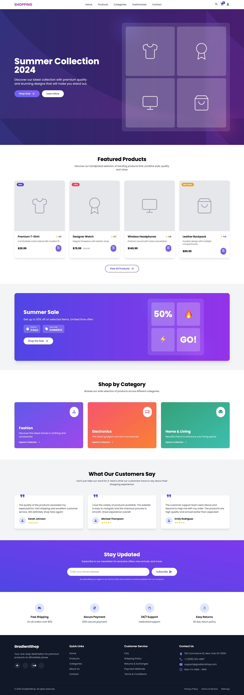

# 🌟 Tailwind Templates Collection

A curated collection of modern, responsive website templates built with **Tailwind CSS**. Each template is designed for real-world use cases — from business landing pages to personal portfolios — and optimized for pixel-perfect responsiveness and clean design.

---

## 📁 Templates

| Template Name                 | Preview                             | Live Demo                        |
|------------------------------|-------------------------------------|----------------------------------|
| FoodExpress                  |      | [Live](https://tailwind-templates-red.vercel.app/FoodExpress/)|
| KidsPlay Booking Site        |      | [Live](https://tailwind-templates-red.vercel.app/KidsPlay/)|
| MedSPA Landing Page          |      | [Live](https://tailwind-templates-red.vercel.app/MedSPA/) |
| ecommerce site               |           | [Live](https://tailwind-templates-red.vercel.app/ecommerce/) |
| Online Education             |      | [Live](https://tailwind-templates-red.vercel.app/education/) |

---

## 🛠️ Tech Stack

- HTML5 + Tailwind CSS
- Fully responsive layouts
- Accessible, scalable UI structure
- Designed for quick deployment (Vercel-ready)

---

## 🚀 Deployment

All templates are ready for deployment to **[Vercel](https://vercel.com/)**. Each project folder can be deployed as a standalone site.

---

## 📌 How to Use

1. Clone the repo:  
   ```bash
   git clone https://github.com/uibyrohith/rohith-templates.git
